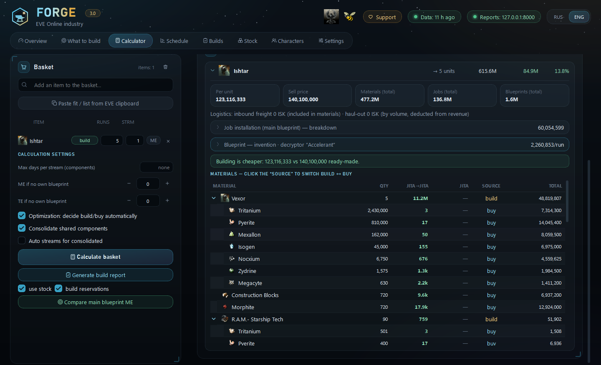
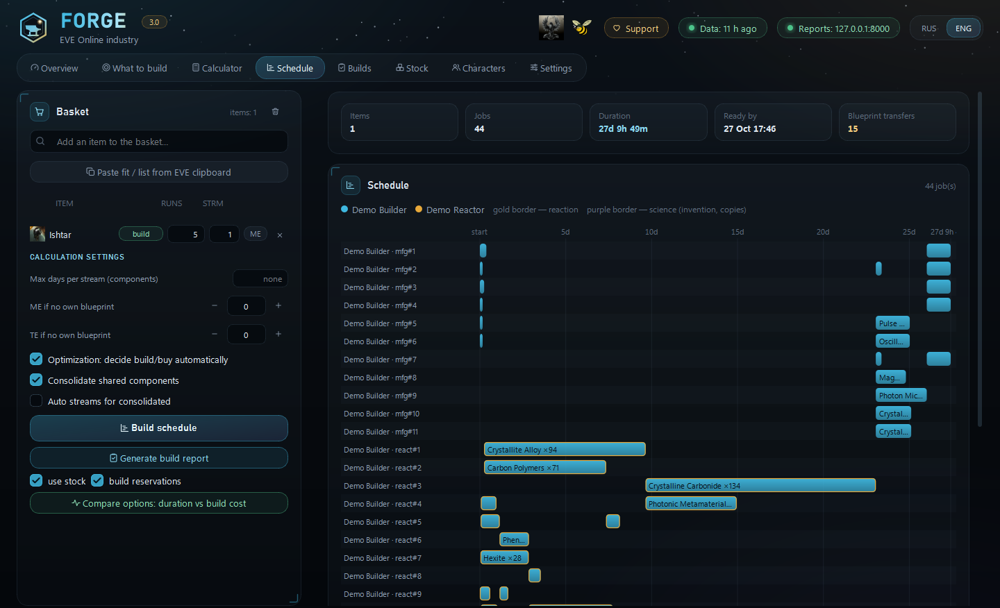
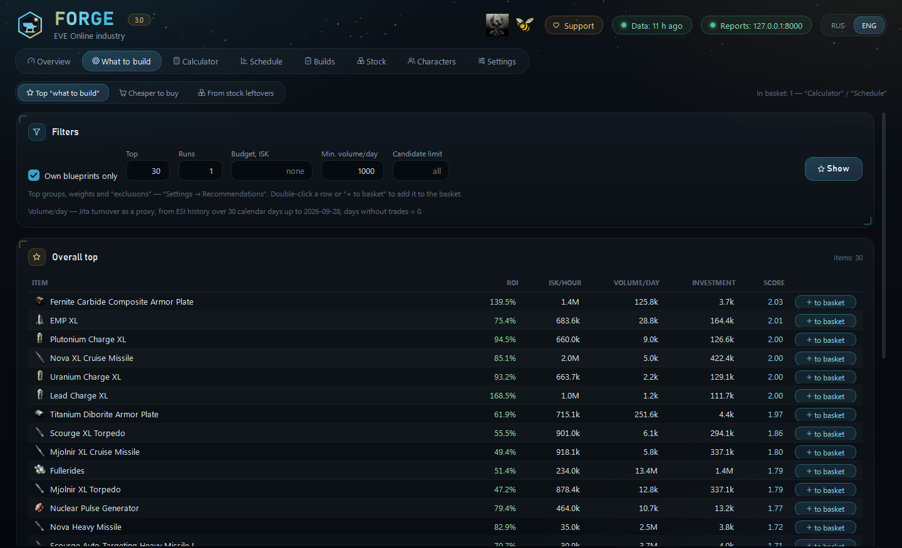

# Forge — EVE Online industry assistant

**English** · [Русский](README.ru.md)

Forge is a **local** desktop tool for EVE Online industrialists. For a specific blueprint it
calculates the exact material quantities and the real build cost — including the best split into
parallel jobs, reactions, invention, freight and what you already have in stock — then schedules
the jobs across your characters' slots, writes build reports and recommends what is worth building.

It runs entirely on your PC. All the math is done locally from a SQLite database; the network is
used only to sync data from the official EVE servers. Interface in English and Russian.



<details>
<summary>More screenshots: Schedule and What to build</summary>





</details>

<sub>Screenshots: demo characters with ME10/TE20 blueprints, real Jita market data, no structure
bonuses.</sub>

**Contents:** [Installation](#installation) · [First run](#first-run) ·
[Step-by-step setup guide](docs/SETUP.md) ·
[How Forge calculates](#how-forge-calculates) · [The program, tab by tab](#the-program-tab-by-tab) ·
[Settings](#settings) · [Configuration file](#configuration-file) · [Command line](#command-line) ·
[Data and privacy](#data-and-privacy) · [Development](#development)

## Installation

### Portable build (Windows 10/11, recommended)

1. Download **`Forge_3.0.zip`** from the [Releases](../../releases) page — Python is included,
   nothing to install, no admin rights needed.
2. Unzip the **whole** folder anywhere (Desktop, Documents…).
3. Double-click **`Forge.cmd`** — the Forge window opens.
4. If Windows shows "Windows protected your PC" — *More info* → *Run anyway* (the program is not
   code-signed; that is all the warning means). If the firewall asks about Python — allow it: it is
   the local report server, it listens on `127.0.0.1` only.

The portable build comes with a ready-made EVE SSO application (Client ID) — you don't need to
register your own. All your data stays in that folder (see [Data and privacy](#data-and-privacy));
to update, unzip the new version and copy `forge.db`, `forge.toml` and `reports/` over.

### From source

Requires Python 3.12+ (Windows 10/11; other platforms are untested).

```powershell
git clone <this repository> Forge
cd Forge
py -3.12 -m venv .venv
.\.venv\Scripts\python.exe -m pip install -e ".[dev,desktop]"
copy forge.example.toml forge.toml
```

Register an application at <https://developers.eveonline.com/>:

- *Connection type* — **Authentication & API Access**;
- *Callback URL* — `http://localhost:8765/callback`;
- *Scopes* — `esi-characters.read_blueprints.v1`, `esi-skills.read_skills.v1`,
  `esi-assets.read_assets.v1`, `esi-industry.read_character_jobs.v1`,
  `esi-wallet.read_character_wallet.v1`, `esi-markets.structure_markets.v1`,
  `esi-universe.read_structures.v1`.

Put its **Client ID** into *Settings → System* (or `[sso] client_id` in `forge.toml`). No secret key
is needed — Forge uses OAuth2 PKCE.

Start the panel with `Forge.cmd` (no console window) or `forge desktop`. Desktop shortcut:
`powershell -ExecutionPolicy Bypass -File make_shortcut.ps1`.

## First run

1. **Overview → Download SDE** — once. The static game data from Fuzzwork is big (about 0.5 GB on
   disk); the download takes a few minutes.
2. **Overview → Add character (EVE SSO)** — the browser opens the official EVE login page; log in
   and allow access. Repeat for every character: slots, blueprints, skills and assets of all of them
   are used (jobs keep running while you are offline).
3. **Characters + structure markets** and **Jita market & indices** — sync the data.
4. **Settings** — set up your places (buy hub, sales market, build system), stations with rigs,
   freight and character roles. Without it Forge still works — just without your structure bonuses
   and freight.

Then use **Calculator** for any blueprint and **What to build** for ideas.

A detailed walkthrough — adding characters, choosing your buy/sell/build locations, setting up
stations with rigs, market structures, freight, roles and stock — is in the
**[step-by-step setup guide](docs/SETUP.md)**.

## How Forge calculates

- **Three places.** The *purchasing hub* (Jita by default), the *sales market / second hub* (a
  market structure, can also be bought from) and the *build location* (where your Engineering
  Complex and Refinery are). All three are set in *Settings → Logistics & market*.
- **Landed cost of a material** = the cheapest of: what's in stock (at replacement price); sales
  market price + freight to the build location; hub price + freight hub → market + freight
  market → build location. Hub order books are checked for available volume.
- **Revenue** = price on the sales market − sales tax and broker fee − haul-out freight.
- **Materials per job** = `max(runs, ceil(base × runs × (1 − ME/100) × structure × rigs))`, rounded
  up **for every job separately** — so splitting a build into parallel jobs ("streams") changes the
  total amount of materials. Reactions ignore ME.
- **Job installation cost** = EIV (`adjusted_price`) × system cost index × structure/rig bonus ×
  (1 + facility tax + SCC surcharge) — computed locally, no online calculators.
- **Build or buy** is decided for every node of the tree (components, reactions, invention).
  Blueprint ownership, ME/TE, skills, slots and running jobs come from your characters.

## The program, tab by tab

### Header

- **♥ Support** — how to send the author some ISK in game (Forge is free).
- **Data: N h ago** — freshness of market and character data; click to go to *Overview*.
- **Reports: 127.0.0.1:8000** — the built-in report server (ports 8000–8010); click to open the
  list of build reports in the browser.
- **RUS / ENG** — interface language (and language of new HTML reports); switches instantly.

### Overview

- **Cards**: characters (wallets, running jobs), stock (value, number of types, mode), data
  freshness, builds in progress.
- **Sync** — the only place where Forge goes online:
  - *Characters + structure markets* — blueprints, skills, assets, industry jobs and wallets of all
    characters; orders of the market structures from *Settings*; names and systems of structures;
  - *Jita market & indices* — Jita price snapshot, market history (once a day), adjusted prices and
    system cost indices;
  - *Download SDE* — the static data dump (once, and after big game patches);
  - *Add character (EVE SSO)*.
  Sync respects the ESI cache — running it again may fetch nothing new.
- **Auto-update** — sync in the background while Forge is open: market and indices every N minutes,
  characters every N minutes.
- **Data sources** — status, time and row count of every sync; **Database contents** — table sizes.
  Characters whose login EVE no longer accepts are listed here with a hint to log in again.

### What to build

Three modes (buttons at the top):

- **Top "what to build"** — items ranked by ROI, ISK/hour and liquidity (columns: *ROI, ISK/hour,
  Volume/day, Investment, Score*), plus a separate top for every group from *Settings →
  Recommendations*. Filters: *Own blueprints only* (candidates from your characters' blueprints or
  everything buildable), *Top*, *Runs*, *Budget, ISK*, *Min. volume/day*, *Candidate limit*.
  Double-click a row or **+ to basket** to add it to the basket.
- **Cheaper to buy** — items the market sells for less than your build cost landed at the build
  location (*Build, Buy, Hub, Savings*). Without groups it scans the whole traded market (~10 s);
  pick EVE groups to narrow it down.
- **From stock leftovers** — builds from your own blueprints with the highest *real* profit (build
  cost minus what's already in stock). The batch size is chosen automatically to use up the scarcest
  material shared with stock (*Runs, Real profit, Real ROI, From stock, % of cost*). Option
  *excluding build reservations* — don't offer what unfinished builds have reserved.

### Calculator

The **basket** (shared with *Schedule*):

- search an item by name, or **Paste fit / list from EVE clipboard** — a fit (Ctrl+C in the fitting
  window) or a list from cargo/hangar;
- every row: **build / buy** (buy ready-made instead of building), **runs**, **streams** (parallel
  jobs for this item), **ME** — an exact ME/TE for this item instead of your blueprint/default
  (doesn't apply to T2 from invention: the decryptor sets it).

**Calculation settings**:

- *Max days per stream (components)* — splits sub-components (reactions, parts) so that each of
  their jobs is ≤ N days, in waves. Changes material usage (rounding per job). Empty — one stream;
- *ME / TE if no own blueprint* — for blueprints nobody owns and that aren't invented;
- *Optimization: decide build/buy automatically* — for each component, whichever is cheaper;
- *Consolidate shared components* — the same sub-component in different branches (and different
  basket items) is built as one shared build: fewer slots, less rounding;
- *Auto streams for consolidated* — gives a shared build as many streams as branches were merged.

**Buttons**: *Calculate basket*; *Generate build report* (with *use stock* — subtract what's in
stock, and *build reservations* — minus what unfinished builds reserved); *Compare main blueprint
ME* — build cost and profit at ME 0–10 (one item in the basket).

**Results**:

- **Basket totals** — build cost, revenue, profit, ROI, materials, job installation,
  blueprints/invention;
- **Preparation / issues** — what to invent (decryptor, attempts, chance), missing blueprints or
  reaction formula copies, copies short of runs, items without a market price;
- **Reprocessing leftovers** — by-products if reprocessing a precursor was cheaper (enabled by
  *reprocessing efficiency* in settings);
- **By item** — per unit cost, sell price, freight in and out, the *job installation* breakdown (EIV,
  system index, station multiplier, taxes), the *invention* breakdown (datacores, T1 copy,
  decryptor, fee, base chance × skills × decryptor, attempts) and the **material tree**: quantity,
  price in every hub, source and total. Click the **source** to switch *build ↔ buy*; a forced
  choice is kept until you click again.

### Schedule

Uses the same basket. **Build schedule** spreads all jobs (reactions, components, invention, copying)
over the manufacturing / reaction / science slots of your characters, taking running jobs into
account:

- summary — items, jobs, duration, *Ready by*, *Blueprint transfers* (jobs given to someone who
  doesn't own the blueprint/formula);
- the **Gantt chart** by character slot (gold border — reaction, purple — science);
- **Compare options: duration vs build cost** — the basket with several preset
  consolidation/duration settings (the set is in *Settings → Planner*); cyan — fastest, green —
  cheapest; double-click to apply an option to the basket;
- *Generate build report*.

### Builds

The list of build reports (created from the basket in *Calculator* or *Schedule*): created, ETA,
jobs done, cost; open in the browser or delete (progress and actual data are deleted and the stock
reservation is released). *List in browser* opens all reports as a web page.

A report is an HTML page served by Forge's local server:

- **Build summary** and **Preparation / issues**;
- **1 · Shopping list** — *Buy in Jita / market* (with **Copy the list for EVE multibuy**), *Build
  yourself (blueprint available)*, *Already in stock — leftovers* (with where each item is);
- **2 · Instructions per character** — a checklist of what each character starts and where;
- **3 · Schedule and cost control** — the job timeline (plan start/finish, planned and actual fee,
  "started" marks, notes), cost plan vs actual by cost item, the **S-curve** plan vs actual.

Everything you enter in a report is saved automatically. A report reserves the stock it uses, so
the next report and *From stock leftovers* don't count the same items twice.

### Stock

What counts as "already have it":

- **Mode**: *Auto* — the build structures (*Settings → Logistics & market → Structures*) plus the
  *Where to look for blueprints* locations; *Pick manually* — tick whole systems (including future
  structures in them), single stations/structures/containers; an unticked box inside a ticked
  system is an exclusion.
- **Where things are** — the tree of all assets: system → station/structure → container, with item
  count, Jita value and role; what the filters cut entirely is greyed out as *not stock*.
- **Filters**: *Whose assets to count* (characters); *Don't count as stock* — fitted modules,
  assembled ships (with something inside), and by location flag (cargo hold, drone bay, fleet
  hangar, deliveries, Asset Safety…).
- **Exclusions and reserve**: *Never take from stock* (items, EVE groups), *Keep N units untouched*.
- **Currently in stock** — the list by the saved settings: available, kept, value, where it is.

Leftovers outside the build location are counted too: from the hubs they come with the same
freight, other systems are flagged in the report.

### Characters

All added characters: wallet, slots (manufacturing / reactions / science, by skills), *Forge
limit*, blueprints, running jobs, assets, last update, "login needed" if EVE rejected the saved
login.

- **Roles**: *Mfg.*, *Reactions*, *Science* (invention and copying). Nobody ticked — everyone takes
  part; *Science* empty — science is done by the manufacturing characters.
- **Forge limit** mfg/react/sci — how many slots the schedule may take (empty — all by skills, 0 —
  not in this pool), to leave some slots for research and your own jobs. Running jobs occupy slots
  until they finish.

## Settings

Seven sections; **Save** writes `forge.toml`, calculations use the new values immediately.

### Manufacturing

- **Manufacturing & taxes** — fallback multipliers for material, job cost and time (used only when
  no station is set for the job's role), structure tax, *SCC surcharge* (0.04 = 4%), *broker fee*
  and *sales tax* on sale, *reprocessing efficiency* (0 — don't consider reprocessing a precursor as
  an alternative to building it).
- **Invention** — *chance with the inventor's skills* (base × (1 + Encryption/40 + (science1 +
  science2)/30) × decryptor, ≤ 100%; the inventor is the best of the *Science* role).
  *Decryptor*: *Auto — by cost*, *No decryptor*, *One for all*; the decryptors allowed for auto
  selection; a decryptor for specific T2 products (overrides the mode). A decryptor without a market
  price falls back to auto with a note in *Preparation / issues*.
- **Always buy** / **Always build** — by EVE group or item (e.g. all Fuel Blocks — always buy).
  *Always buy* wins if an item is in both lists.

### Stations

Your structures, one card per station:

- **Role** — reactions, invention, copying, T2 components (by group), manufacturing (everything
  else). Several stations of one role can serve different product groups.
- **Located at** — the structure in EVE; **System** — auto (from the structure) or chosen manually:
  its cost index and the low/null-sec rig bonus are used.
- **Structure type** (Raitaru, Azbel, Sotiyo, Athanor, Tatara…) and **rigs / service modules** —
  ME/time bonuses are computed from the SDE with stacking penalties.
- Manual *ME / time / job cost savings, %* — only when no rigs and no structure type are set;
  **Station tax, %** — set by the structure owner.
- **Which products go here** — EVE groups/categories (empty — everything in this role).

Moving materials between systems isn't modelled — they are treated as delivered to the build system.

### Logistics & market

- **Locations** — the three roles: *Purchasing hub*, *Sales market / 2nd hub*, *Build location*
  (system; the market region is used for prices; names appear in reports).
- **Structures** — the default market structure; the Engineering Complex and Refinery of the build
  location (used by *Auto* stock).
- **Market** — *Buy in Jita (+ delivery)* and/or *Buy in the sales market* (both off = both
  allowed); *Sale: place a sell order* or *Sale: straight into buy orders*.
- **Freight** — three legs (hub → market, market → build, build → market), each either
  **per_m3** (ISK/m³ with a minimum per order — counted once per order) or **fixed_jump** (by trips:
  ISK per jump, ship capacity m³, load factor; N loads per order ⇒ 2N − 1 jumps). Volume is summed
  over the whole order.
- **Ships that fly out themselves** — EVE groups (jump freighters, carriers, dreads, titans…) that
  are hauled out as fuel per jump per unit, not by volume.
- **Market structures** — structures whose orders are merged into one sales market snapshot
  (lowest sell, highest buy, total volume). Each is fetched by a character with access; one failing
  structure doesn't break the others.

### Recommendations

- **Weights and filters** — ROI / ISK-hour / liquidity weights, *Min. daily volume*, *Max
  investment per batch*, *Default runs*, *Top size per group*, *Broken blueprint filter* (build
  cost / price ≥ — cuts SDE artifacts), *Outlier winsorization*, *Cheaper to buy: max savings*.
- **Liquidity — where "Volume/day" comes from**: the sales market history by records (default;
  without history — the volume listed for sale), *actual turnover of the sales region* (ESI regional
  history incl. player structures, downloaded daily), or *Jita turnover as a proxy*; plus the window
  in calendar days (days without trades = 0).
- **Exclusions — never recommend** (items, groups, categories); **Cheaper to buy: exclude
  categories** (Asteroid by default — ore/ice compression).
- **Top groups** — any number of named groups of EVE groups, each gets its own top.
- **Defaults on the What to build tab**.

### Blueprints

- **Manual blueprint cost (ISK per run)** — for blueprints you don't own and can't invent (for a
  T1 invention blueprint — the price of one T1 copy per attempt).
- **Where to look for blueprints** — only blueprints in the ticked locations (and containers
  inside) count as yours; nothing ticked — all of them. Affects blueprint cost, ME/TE, the "own
  blueprints" top and job assignment.

### Planner

- *Account for jobs already running* — their slots stay busy until they finish;
- *Schedule T1 blueprint copying for invention* — copy jobs from your own BPO in the science pool
  before invention (invention waits for its copies; one BPO — one job at a time). Off — copying cost
  is counted but its time isn't;
- *Max streams per component* when splitting to meet a deadline;
- *Compare options* — the list of "max N days per stream" limits (0.5 = 12 h);
- **Who gets the job — blueprint owner**: *Anyone — whoever finishes first* (fastest, but
  blueprints have to be passed between characters — listed in the schedule and the report), *Prefer
  the owner* within a tolerance in hours, *Owner only*;
- **Default basket** (on start): consolidate, auto streams, ME/TE if no own blueprint.

### System

- **EVE SSO** — *Client ID*, *callback port* (must match the application's Callback URL), the list
  of scopes. Change the Client ID — characters have to be added again.
- **Data** — where the database, settings, reports, log and panel state are; *Open in Explorer*.

## Configuration file

Everything above lives in `forge.toml` next to the program (`forge.example.toml` is the annotated
reference with every key; the panel rewrites `forge.toml` without comments). Sections: top-level
character roles, blueprint locations, always buy/build and jump-capable groups; `[sso]`,
`[locations.*]`, `[structures]`, `[industry]`, `[invention]`, `[market]`, `[stock]`, `[planner]`
(+ `[[planner.slot_limits]]`), `[recommend]` (+ `[[recommend.groups]]`), `[ui]`, `[autosync]`,
`[[facilities]]`, `[[freight_routes]]`. Top-level keys must come before the first `[section]`.

## Command line

```powershell
forge sync [all|sde|market|industry|character]   # sync data
forge status                                     # data freshness
forge auth add | forge auth list                 # characters (EVE SSO)
forge cost "Rifter" --runs 10 --streams 2 --me 10
forge plan "Rifter" --runs 10 --streams 5
forge recommend --top 20
forge desktop                                    # the panel
forge web                                        # report server / API only
```

In the portable build the same commands are available as
`python\python.exe -m forge.interface.cli …`. The command line speaks Russian only.

## Data and privacy

- Everything stays in the program folder: `forge.db` (database), `forge.toml` (settings),
  `sde-latest.sqlite` (SDE dump), `reports/` (build reports), `.forge/` (window state, basket, icon
  cache), `forge_desktop.log` (errors).
- Network access goes only to `esi.evetech.net` and `login.eveonline.com` (EVE API and login),
  `images.evetech.net` (icons and logos) and `fuzzwork.co.uk` (SDE dump, market aggregates).
- EVE SSO uses OAuth2 PKCE: no application secret. Refresh tokens are kept in the Windows Credential
  Manager (via `keyring`), never in the database or in `forge.toml`. All scopes are read-only.
- The report server listens on `127.0.0.1` only (ports 8000–8010).

## Development

```powershell
.\.venv\Scripts\python.exe -m pytest     # no live network calls: ESI/Fuzzwork are mocked
.\.venv\Scripts\ruff.exe check forge tests tools
.\.venv\Scripts\mypy.exe forge
```

Architecture, layer rules and the cost formulas: [docs/ARCHITECTURE.md](docs/ARCHITECTURE.md);
database schema: [docs/schema.sql](docs/schema.sql). The code and its comments are in Russian; UI
strings are Russian keys translated via `forge/i18n/en_*.py`.

Portable zip: `py -3.12 tools\build_portable.py` — takes the official embeddable Python 3.12 from
python.org (or a local one via `--python-embed`), installs the dependencies and writes
`dist/Forge_<version>.zip`.

## Support

Forge is free. If it saves you time and ISK, send the author some ISK in game — the **♥ Support**
button in the header shows who and how.

## License

[MIT](LICENSE).

EVE Online and the EVE logo are the registered trademarks of Fenris Creations ehf. (formerly
CCP hf.). All rights are reserved worldwide. All other trademarks are the property of their
respective owners. Forge is a third-party tool; it is not affiliated with or endorsed by Fenris
Creations. Item images are served by the EVE Image Server; game data comes from the EVE Swagger
Interface (ESI) and the SDE.
