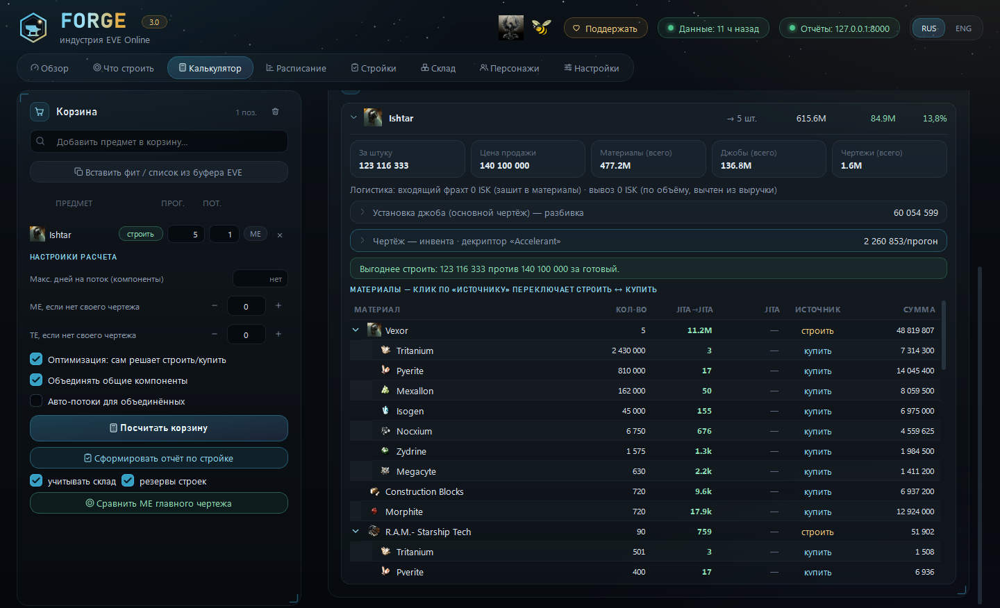
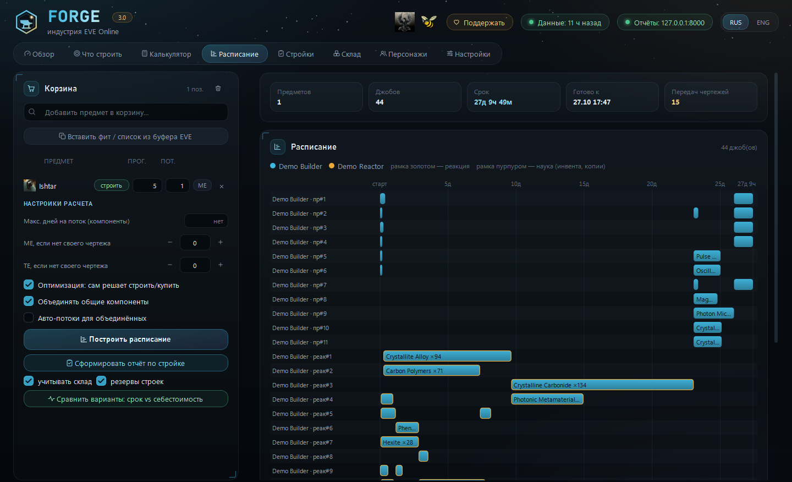
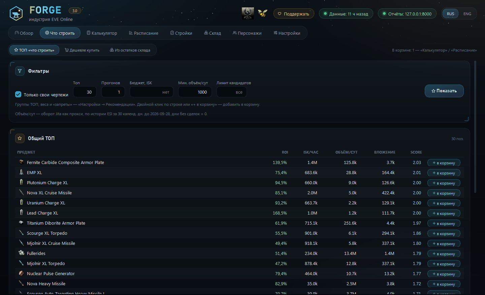

# Forge — помощник по индустрии EVE Online

[English](README.md) · **Русский**

Forge — **локальная** десктопная программа для индустриалов EVE Online. Под конкретный чертёж
считает точное количество материалов и реальную стоимость постройки — с оптимальной разбивкой на
параллельные джобы, реакциями, инвентой, фрахтом и тем, что уже лежит на складе, — строит
расписание по слотам ваших персонажей, пишет отчёты по стройкам и рекомендует, что выгодно строить.

Работает целиком на вашем компьютере. Вся математика — локально по базе SQLite; сеть нужна только
для синхронизации с официальными серверами EVE. Интерфейс на русском и английском.



<details>
<summary>Ещё скриншоты: Расписание и Что строить</summary>





</details>

<sub>Скриншоты: демо-персонажи с чертежами ME10/TE20, реальные данные рынка Jita, без бонусов
структур.</sub>

**Содержание:** [Установка](#установка) · [Первый запуск](#первый-запуск) ·
[Как Forge считает](#как-forge-считает) · [Программа по вкладкам](#программа-по-вкладкам) ·
[Настройки](#настройки) · [Файл настроек](#файл-настроек) · [Командная строка](#командная-строка) ·
[Данные и приватность](#данные-и-приватность) · [Разработка](#разработка)

## Установка

### Переносная сборка (Windows 10/11, рекомендуется)

1. Скачайте **`Forge_3.0.zip`** со страницы [Releases](../../releases) — Python внутри, ставить
   ничего не нужно, права администратора не нужны.
2. Распакуйте папку **целиком** куда угодно (Рабочий стол, Документы…).
3. Дважды кликните **`Forge.cmd`** — откроется окно Forge.
4. Если Windows покажет «Windows защитил ваш компьютер» — «Подробнее» → «Выполнить в любом случае»
   (у программы нет цифровой подписи, предупреждение только об этом). Если брандмауэр спросит про
   Python — разрешите: это локальный сервер отчётов, он слушает только `127.0.0.1`.

В сборке уже есть приложение EVE SSO (Client ID) — регистрировать своё не нужно. Все ваши данные
лежат в этой папке (см. [Данные и приватность](#данные-и-приватность)); чтобы обновиться, распакуйте
новую версию и перенесите в неё `forge.db`, `forge.toml` и `reports/`.

### Из исходников

Нужен Python 3.12+ (Windows 10/11; на других ОС не проверялось).

```powershell
git clone <этот репозиторий> Forge
cd Forge
py -3.12 -m venv .venv
.\.venv\Scripts\python.exe -m pip install -e ".[dev,desktop]"
copy forge.example.toml forge.toml
```

Зарегистрируйте приложение на <https://developers.eveonline.com/>:

- *Connection type* — **Authentication & API Access**;
- *Callback URL* — `http://localhost:8765/callback`;
- *Scopes* — `esi-characters.read_blueprints.v1`, `esi-skills.read_skills.v1`,
  `esi-assets.read_assets.v1`, `esi-industry.read_character_jobs.v1`,
  `esi-wallet.read_character_wallet.v1`, `esi-markets.structure_markets.v1`,
  `esi-universe.read_structures.v1`.

Его **Client ID** — в «Настройки → Система» (или `[sso] client_id` в `forge.toml`). Секретный ключ
не нужен — Forge использует OAuth2 PKCE.

Пульт — `Forge.cmd` (без консоли) или `forge desktop`. Ярлык на рабочий стол —
`powershell -ExecutionPolicy Bypass -File make_shortcut.ps1`.

## Первый запуск

1. **Обзор → Скачать SDE** — один раз. Статические данные игры с Fuzzwork большие (~0,5 ГБ на
   диске), закачка — несколько минут.
2. **Обзор → Добавить персонажа (EVE SSO)** — откроется официальная страница входа EVE; войдите и
   разрешите доступ. Повторите для каждого персонажа: слоты, чертежи, скиллы и ассеты считаются по
   всем (джобы идут и оффлайн).
3. **Персонажи + рынки структур** и **Рынок Jita и индексы** — синхронизация данных.
4. **Настройки** — свои места (хаб закупки, рынок сбыта, система стройки), станции с ригами, фрахт,
   роли персонажей. Без этого Forge тоже работает — просто без бонусов ваших структур и без фрахта.

Дальше — **Калькулятор** для любого чертежа и **Что строить** для идей.

## Как Forge считает

- **Три места.** *Хаб закупки* (по умолчанию Jita), *рынок сбыта / 2-й хаб* (рынок-структура, там же
  можно и закупать) и *место стройки* (где ваши Engineering Complex и Refinery). Все три — в
  «Настройки → Логистика и рынок».
- **Себестоимость материала с доставкой** = самое дешёвое из: что есть на складе (по цене
  замещения); цена рынка сбыта + фрахт до стройки; цена хаба + фрахт хаб → рынок + фрахт рынок →
  стройка. Объём в стаканах хабов учитывается.
- **Выручка** = цена на рынке сбыта − налог и брокер − фрахт вывоза.
- **Материалы на джоб** = `max(runs, ceil(base × runs × (1 − ME/100) × структура × риги))`, округление
  вверх **на каждый джоб отдельно** — поэтому разбивка на параллельные джобы («потоки») меняет общий
  расход материалов. Реакции ME игнорируют.
- **Установка джоба** = EIV (`adjusted_price`) × индекс стоимости системы × бонус структуры и ригов ×
  (1 + налог структуры + SCC) — считается локально, без онлайн-калькуляторов.
- **Строить или купить** решается по каждому узлу дерева (компоненты, реакции, инвента). Владение
  чертежами, ME/TE, скиллы, слоты и уже идущие джобы — из ваших персонажей.

## Программа по вкладкам

### Шапка

- **♥ Поддержать** — как перевести автору ISK в игре (Forge бесплатный).
- **Данные: N ч назад** — свежесть рынка и персонажей; клик — на «Обзор».
- **Отчёты: 127.0.0.1:8000** — встроенный сервер отчётов (порты 8000–8010); клик — список отчётов по
  стройкам в браузере.
- **RUS / ENG** — язык интерфейса (и новых HTML-отчётов), переключается сразу.

### Обзор

- **Карточки**: персонажи (кошельки, идущие джобы), склад (оценка, число позиций, режим), свежесть
  данных, стройки в работе.
- **Синхронизация** — единственное место, где Forge ходит в сеть:
  - «Персонажи + рынки структур» — чертежи, скиллы, ассеты, джобы и кошельки всех персонажей; ордера
    рынков-структур из «Настроек»; имена и системы структур;
  - «Рынок Jita и индексы» — снапшот цен Jita, история рынка (раз в сутки), adjusted prices и
    индексы стоимости систем;
  - «Скачать SDE» — дамп статических данных (один раз и после больших патчей игры);
  - «Добавить персонажа (EVE SSO)».
  Синк уважает кэш ESI — повторный запуск может ничего не докачать.
- **Автообновление** — синк в фоне, пока открыт пульт: рынок и индексы раз в N минут, персонажи раз
  в N минут.
- **Источники данных** — статус, время и число строк каждого синка; **Наполнение БД** — размеры
  таблиц. Здесь же — персонажи, чей вход EVE больше не принимает, с подсказкой войти заново.

### Что строить

Три режима (кнопки сверху):

- **ТОП «что строить»** — предметы по ROI, ISK/час и ликвидности (колонки: *ROI, ISK/час, Объём/сут,
  Вложение, Score*) плюс отдельный ТОП для каждой группы из «Настройки → Рекомендации». Фильтры:
  «Только свои чертежи» (кандидаты — из чертежей персонажей или всё производимое), «Топ», «Прогонов»,
  «Бюджет, ISK», «Мин. объём/сут», «Лимит кандидатов». Двойной клик по строке или **+ в корзину** —
  добавить в корзину.
- **Дешевле купить** — предметы, которые рынок продаёт дешевле вашей себестоимости с доставкой до
  стройки (*Строить, Купить, Хаб, Экономия*). Без групп — весь торгуемый рынок (~10 с); выберите
  EVE-группы, чтобы сузить.
- **Из остатков склада** — постройки из своих чертежей с максимальной *реальной* прибылью
  (себестоимость минус то, что уже лежит на складе). Размер партии подбирается сам — чтобы вычерпать
  самый дефицитный общий со складом материал (*Прогонов, Реальная прибыль, Реальный ROI, Со склада,
  % себест.*). Опция «без резервов строек» — не предлагать то, что зарезервировали незавершённые
  стройки.

### Калькулятор

**Корзина** (общая с «Расписанием»):

- поиск предмета по названию или **Вставить фит / список из буфера EVE** — фит (Ctrl+C в окне фита)
  или список из груза/ангара;
- в каждой строке: **строить / купить** (купить готовым вместо постройки), **прогоны**, **потоки**
  (параллельных джобов на этот предмет), **ME** — точный ME/TE этого предмета вместо своего
  чертежа/дефолта (на T2 из инвенты не действует: там ME/TE задаёт декриптор).

**Настройки расчёта**:

- «Макс. дней на поток (компоненты)» — дробит под-компоненты (реакции, детали) так, чтобы каждый их
  джоб был ≤ N дней, волнами. Меняет расход материалов (округление на каждый джоб). Пусто — один
  поток;
- «ME / TE, если нет своего чертежа» — для чертежей, которых нет ни у кого и которые не инвентятся;
- «Оптимизация: сам решает строить/купить» — по каждому компоненту, что дешевле;
- «Объединять общие компоненты» — одинаковый под-компонент в разных ветках (и разных товарах корзины)
  строится одной общей постройкой: меньше слотов, меньше потерь на округлении;
- «Авто-потоки для объединённых» — даёт общей постройке столько потоков, сколько веток в неё слито.

**Кнопки**: «Посчитать корзину»; «Сформировать отчёт по стройке» (с галками «учитывать склад» —
вычесть то, что лежит на складе, и «резервы строек» — минус зарезервированное незавершёнными
стройками); «Сравнить ME главного чертежа» — себестоимость и прибыль при ME 0–10 (один предмет в
корзине).

**Результат**:

- **Итого по корзине** — себестоимость, выручка, прибыль, ROI, материалы, установка джобов,
  чертежи/инвента;
- **Подготовка / проблемы** — что заинвентить (декриптор, попытки, шанс), каких чертежей или копий
  формул реакций не хватает, у каких копий мало ранов, у чего нет рыночной цены;
- **Останется от переработки** — побочка, если переработать прекурсор было дешевле (включается
  «эффективностью переработки» в настройках);
- **По предметам** — за штуку, цена продажи, фрахт туда и обратно, разбивка **установки джоба**
  (EIV, индекс системы, множитель станции, налоги), разбивка **инвенты** (датакоры, T1-копия,
  декриптор, взнос, базовый шанс × скиллы × декриптор, попытки) и **дерево материалов**:
  количество, цена в каждом хабе, источник и сумма. Клик по **источнику** переключает
  *строить ↔ купить*; ручной выбор держится, пока не кликнете снова.

### Расписание

Та же корзина. **Построить расписание** раскладывает все джобы (реакции, компоненты, инвента,
копирование) по слотам производства / реакций / науки ваших персонажей с учётом уже идущих джобов:

- сводка — предметов, джобов, срок, «Готово к», «Передач чертежей» (джобы, отданные не владельцу
  чертежа/формулы);
- **Gantt** по слотам персонажей (рамка золотом — реакция, пурпуром — наука);
- **Сравнить варианты: срок vs себестоимость** — корзина при нескольких готовых настройках
  объединения/срока (набор — «Настройки → Планировщик»); cyan — самый быстрый, зелёным — самый
  дешёвый; двойной клик — применить вариант к корзине;
- «Сформировать отчёт по стройке».

### Стройки

Список отчётов по стройкам (создаются из корзины в «Калькуляторе» или «Расписании»): создан, ETA,
сколько джобов запущено, стоимость; открыть в браузере или удалить (прогресс и факт-данные удалятся,
резерв склада освободится). «Список в браузере» — все отчёты веб-страницей.

Отчёт — HTML-страница на локальном сервере Forge:

- **Сводка по стройке** и **Подготовка / проблемы**;
- **1 · Список закупок** — «Купить в Jita / на рынке» (с кнопкой **Скопировать список для
  мультипокупки EVE**), «Строить самому (чертёж есть)», «Уже на складе — остатки» (где что лежит);
- **2 · Инструкции по персонажам** — чек-лист: что и где запускает каждый персонаж;
- **3 · Контроль сроков и стоимости** — сроки по джобам (план старт/финиш, плановый и фактический
  взнос, отметки «запущено», заметки), стоимость план vs факт по статьям, **S-кривая** план vs факт.

Всё, что вы вносите в отчёт, сохраняется автоматически. Отчёт резервирует использованный склад —
следующий отчёт и «Из остатков» не посчитают те же предметы дважды.

### Склад

Что считать «уже есть»:

- **Режим**: «Авто» — структуры стройки («Настройки → Логистика и рынок → Структуры») плюс локации
  «Где искать чертежи»; «Выбрать вручную» — системы целиком (включая будущие структуры в них),
  отдельные станции/структуры/контейнеры; снятая галка внутри выбранной системы — исключение.
- **Где что лежит** — дерево всех ассетов: система → станция/структура → контейнер, с числом
  предметов, оценкой по Jita и ролью; то, что фильтры отсекают целиком, — серым «не склад».
- **Фильтры**: «Чьи ассеты считать» (персонажи); «Не считать складом» — модули в слотах фита,
  собранные корабли (с чем-то внутри) и по флагу места (трюм, дронбей, флотский ангар, доставки,
  Asset Safety…).
- **Запреты и запас**: «Никогда не брать со склада» (предметы, EVE-группы), «Не трогать N штук».
- **Сейчас на складе** — список по сохранённой настройке: можно взять, не трогать, оценка, где лежит.

Остатки вне места стройки тоже идут в дело: из хабов их довозят тем же фрахтом, прочие системы
помечаются в отчёте.

### Персонажи

Все добавленные персонажи: кошелёк, слоты (производство / реакции / наука — по скиллам), «Лимит
Forge», чертежи, идущие джобы, ассеты, когда обновлён, «нужен вход», если EVE отклонила сохранённый
вход.

- **Роли**: «Произв.», «Реакции», «Наука» (инвента и копирование). Никто не отмечен — участвуют все;
  «Наука» пустая — наукой занимаются те, кто на производстве.
- **Лимит Forge** пр/рк/нк — сколько слотов может занять расписание (пусто — все по скиллам, 0 — не
  участвует в пуле), чтобы оставить часть под ресёрч и свои джобы. Идущие джобы занимают слоты до
  окончания.

## Настройки

Семь разделов; **Сохранить** пишет `forge.toml`, расчёты сразу используют новые значения.

### Производство

- **Производство и налоги** — запасные множители материалов, стоимости и времени джоба (действуют,
  только если под роль джоба нет станции), налог структуры, *SCC surcharge* (0.04 = 4%), брокер и
  налог с продажи, *эффективность переработки* (0 — не рассматривать переработку прекурсора как
  альтернативу постройке).
- **Инвента** — «шанс со скиллами инвентора» (база × (1 + Encryption/40 + (наука1 + наука2)/30) ×
  декриптор, ≤ 100%; инвентор — лучший из роли «Наука»). «Декриптор»: «Авто — по стоимости», «Без
  декриптора», «Один для всех»; разрешённые для авто-выбора; декриптор для конкретных T2-товаров
  (сильнее режима). Декриптор без рыночной цены — фолбэк на авто с пометкой в «Подготовка /
  проблемы».
- **Всегда покупать** / **Всегда строить** — по EVE-группам или предметам (напр. все Fuel Block —
  всегда покупать). «Всегда покупать» сильнее, если предмет в обоих списках.

### Станции

Ваши структуры, по карточке на станцию:

- **Роль** — реакции, инвента, копирование, T2-компоненты (по группам), производство (остальное).
  Несколько станций одной роли могут обслуживать разные группы продуктов.
- **Где стоит** — структура в EVE; **Система** — авто (из структуры) или выбранная вручную: от неё
  индекс стоимости джобов и бонус ригов в low/null-sec.
- **Тип структуры** (Raitaru, Azbel, Sotiyo, Athanor, Tatara…) и **риги / сервис-модули** — бонусы
  ME/времени считаются из SDE, со стэкинг-пенальти.
- Ручные «ME / время / стоимость джоба — экономия, %» — только если риги и тип структуры не заданы;
  **Налог станции, %** — налог владельца структуры.
- **Какие продукты сюда** — EVE-группы/категории (пусто — всё в этой роли).

Перевозка материалов между системами не моделируется — они считаются доставленными в систему
стройки.

### Логистика и рынок

- **Места** — три роли: «Хаб закупки», «Рынок сбыта / 2-й хаб», «Место стройки» (система; регион
  рынка — для цен; названия идут в отчёты).
- **Структуры** — рынок-структура по умолчанию; Engineering Complex и Refinery места стройки (для
  склада в режиме «Авто»).
- **Рынок** — «Покупать в Jita (+ доставка)» и/или «Покупать на рынке сбыта» (обе выключены = обе
  разрешены); «Продажа: выставить sell-ордер» или «Продажа: сразу в buy-ордер».
- **Фрахт** — три плеча (хаб → рынок, рынок → стройка, стройка → рынок), каждое либо **per_m3**
  (ISK/м³ с минимумом за заказ — один раз на заказ), либо **fixed_jump** (рейсами: ISK за прыжок,
  вместимость корабля м³, коэффициент загрузки; N партий за заказ ⇒ 2N − 1 прыжков). Объём
  суммируется по всему заказу.
- **Самоходные при вывозе** — EVE-группы (JF, карриеры, дреды, титаны…), которые вывозятся как
  топливо за прыжок за штуку, а не по объёму.
- **Рынки-структуры** — структуры, чьи ордера сводятся в один срез рынка сбыта (минимальный sell,
  максимальный buy, суммарный объём). Каждую тянет персонаж с доступом; ошибка одной структуры не
  мешает остальным.

### Рекомендации

- **Веса и фильтры** — веса ROI / ISK-час / ликвидности, «Мин. суточный объём», «Потолок вложения на
  партию», «Прогонов по умолчанию», «Размер ТОП на группу», «Фильтр битых чертежей» (себестоимость /
  цена ≥ — отсекает артефакты SDE), «Винзоризация выбросов», «Дешевле купить: макс. экономия».
- **Ликвидность — откуда «Объём/сут»**: история рынка сбыта по записям (по умолчанию; без истории —
  выставленный на продажу объём), *реальный оборот региона сбыта* (история ESI по региону, со
  сделками в структурах игроков, качается раз в сутки) или *оборот Jita как прокси*; плюс окно в
  календарных днях (дни без сделок = 0).
- **Запреты — никогда не рекомендовать** (предметы, группы, категории); **«Дешевле купить»:
  исключить категории** (по умолчанию Asteroid — компрессия руды/льда).
- **Группы ТОП** — сколько угодно именованных наборов EVE-групп, у каждого свой ТОП.
- **Значения по умолчанию на вкладке «Что строить»**.

### Чертежи

- **Стоимость чертежей вручную (ISK на 1 прогон)** — для чертежей, которыми не владеете и которые
  нельзя заинвентить (для T1-чертежа инвенты — цена одной T1-копии на попытку).
- **Где искать чертежи** — «своими» считаются только чертежи в отмеченных локациях (и контейнерах
  внутри); ничего не отмечено — все. Влияет на стоимость чертежа, ME/TE, ТОП «свои чертежи» и
  назначение джобов.

### Планировщик

- «Учитывать уже запущенные джобы» — их слоты заняты до окончания;
- «Ставить копирование T1-чертежа для инвенты в расписание» — копи-джобы со своего BPO в пуле науки
  перед инвентой (инвента ждёт свои копии; один BPO — один джоб за раз). Выкл — стоимость копий
  учтена, их время — нет;
- «Потолок потоков одного компонента» при разбивке под срок;
- «Сравнить варианты» — список сроков «макс. N дней на поток» (0.5 = 12 ч);
- **Кому ставить джоб — владелец чертежа**: «Любому — кто раньше закончит» (быстрее всего, но
  чертежи придётся передавать между чарами — список в расписании и отчёте), «Предпочитать владельца»
  с допуском в часах, «Только владельцу»;
- **Корзина по умолчанию** (при запуске): объединять компоненты, авто-потоки, ME/TE без своего
  чертежа.

### Система

- **EVE SSO** — *Client ID*, *порт callback* (должен совпадать с Callback URL приложения), список
  скоупов. Сменили Client ID — персонажей нужно добавить заново.
- **Данные** — где лежат база, настройки, отчёты, лог и состояние пульта; «Открыть в Проводнике».

## Файл настроек

Всё перечисленное хранится в `forge.toml` рядом с программой (`forge.example.toml` — справочник с
комментариями ко всем ключам; пульт переписывает `forge.toml` без комментариев). Разделы: ключи
верхнего уровня — роли персонажей, локации чертежей, «всегда покупать/строить», самоходные группы;
`[sso]`, `[locations.*]`, `[structures]`, `[industry]`, `[invention]`, `[market]`, `[stock]`,
`[planner]` (+ `[[planner.slot_limits]]`), `[recommend]` (+ `[[recommend.groups]]`), `[ui]`,
`[autosync]`, `[[facilities]]`, `[[freight_routes]]`. Ключи верхнего уровня пишутся до первой
`[секции]`.

## Командная строка

```powershell
forge sync [all|sde|market|industry|character]   # синк источников
forge status                                     # свежесть данных
forge auth add | forge auth list                 # персонажи (EVE SSO)
forge cost "Rifter" --runs 10 --streams 2 --me 10
forge plan "Rifter" --runs 10 --streams 5
forge recommend --top 20
forge desktop                                    # пульт
forge web                                        # только сервер отчётов/API
```

В переносной сборке те же команды — `python\python.exe -m forge.interface.cli …`.

## Данные и приватность

- Всё лежит в папке программы: `forge.db` (база), `forge.toml` (настройки), `sde-latest.sqlite`
  (дамп SDE), `reports/` (отчёты по стройкам), `.forge/` (состояние окна, корзина, кэш иконок),
  `forge_desktop.log` (ошибки).
- Сеть — только `esi.evetech.net` и `login.eveonline.com` (API и вход EVE), `images.evetech.net`
  (иконки и логотипы) и `fuzzwork.co.uk` (дамп SDE, агрегаты рынка).
- EVE SSO — OAuth2 PKCE, секрета приложения нет. Refresh-токены хранятся в Диспетчере учётных данных
  Windows (через `keyring`), не в базе и не в `forge.toml`. Все скоупы — только чтение.
- Сервер отчётов слушает только `127.0.0.1` (порты 8000–8010).

## Разработка

```powershell
.\.venv\Scripts\python.exe -m pytest     # живых сетевых вызовов нет — ESI/Fuzzwork замоканы
.\.venv\Scripts\ruff.exe check forge tests tools
.\.venv\Scripts\mypy.exe forge
```

Архитектура, правила слоёв и формулы — [docs/ARCHITECTURE.md](docs/ARCHITECTURE.md), схема БД —
[docs/schema.sql](docs/schema.sql).

Переносной архив — `py -3.12 tools\build_portable.py`: берёт официальный embeddable Python 3.12 с
python.org (или локальный: `--python-embed`), ставит зависимости и пишет
`dist/Forge_<версия>.zip`.

## Поддержать

Forge бесплатный. Если он экономит вам время и ISK — переведите автору ISK в игре: кнопка
**♥ Поддержать** в шапке подскажет, кому и как.

## Лицензия

[MIT](LICENSE).

EVE Online и логотип EVE — зарегистрированные товарные знаки Fenris Creations ehf. (ранее CCP hf.).
Все права защищены. Forge — сторонняя программа, не связана с Fenris Creations и не одобрена ею.
Изображения предметов — с EVE Image Server; игровые данные — из ESI и SDE.
